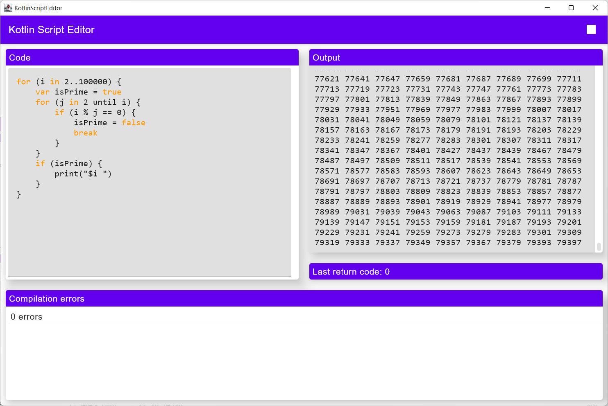
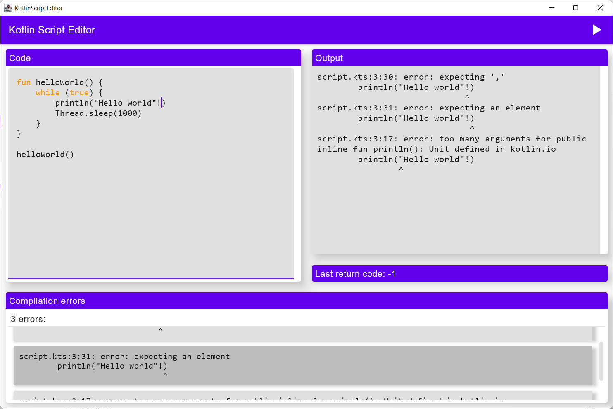
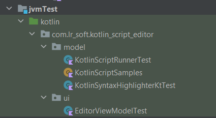

# KotlinScriptRunner

## How to run
Run with `./gradlew run`

Execute tests with `./gradlew test`

## Description

This program uses Kotlin and Compose Multiplatform for a GUI, JUnit 5 and Mockito for tests.
It uses coroutines and channels for multithreading.

In addition to the features required by the task, here's some extra implemented:

- You can stop the program execution by pressing the button.
- Kotlin keyword highlighting.
- You can navigate from compilation errors to positions in code.

- Besides that, the model and ViewModel were covered by unit tests.

